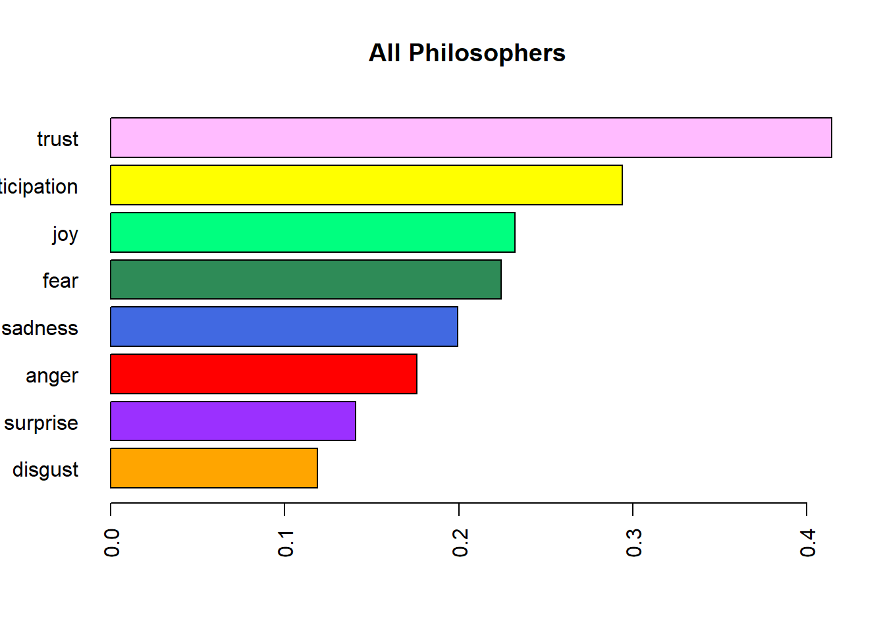
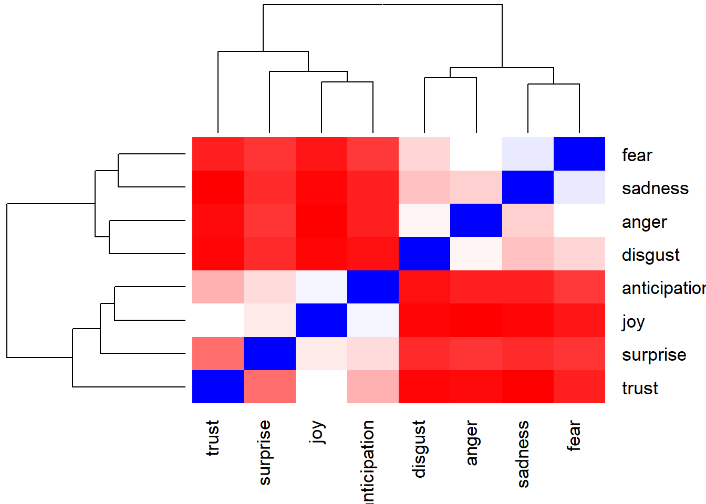
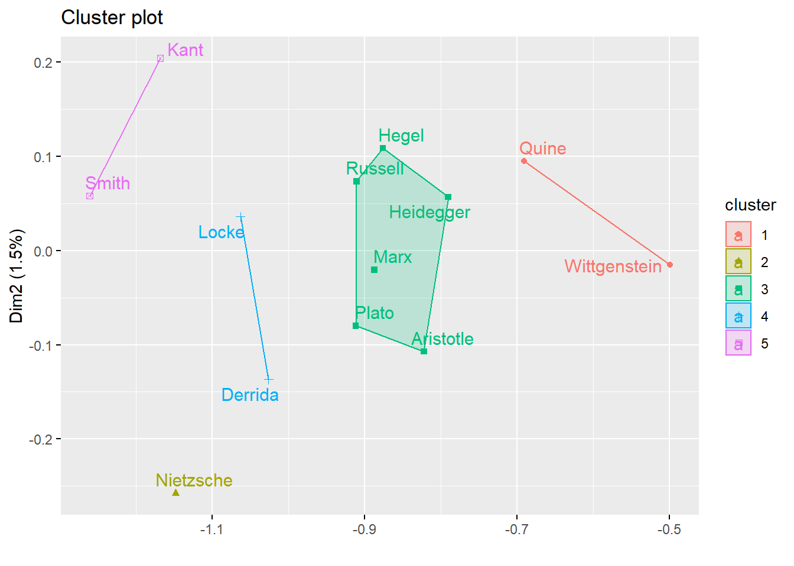

# Sentimental Analysis

## Emotions from philosophers

I conduct the sentimental analysis and find the following histogram from the philosophers I choose.

{width=60%}

From the plot, trust is the emotion that appear the most in this groups of philosophers. This explain why trust is one of the most important motions to the development of world and society. 

Interestingly, positive word seems to appear more frequently than negative words. This is also comes with our recognition that philosophy gives us meaningful and enlightening message. 

## Cluster plot

{width=60%}

From the above plot, positive emotion such as trust is grouped with emotions with the same direction, like joy and anticipation. The same comes with negative emotions. 

{width=60%}

The cluster plot gives us the cluster of emotions of philosophers. Most of the philosopher were in one group except for **Nietzsche**, who is famous for criticizing European religion. Most of his word may contain negative emotions, which may make him obviously different from the others.
