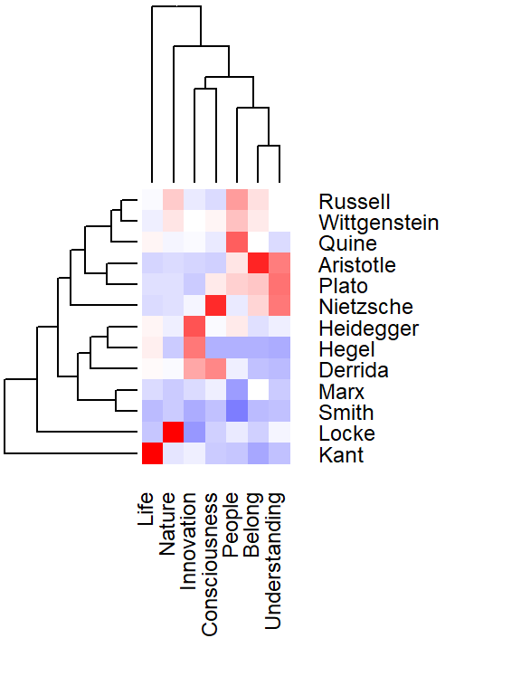
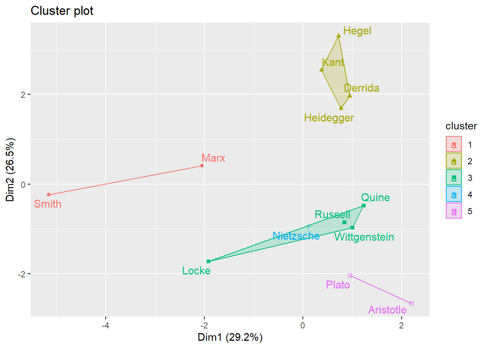

# Topic Modeling

## Topic generated by LDA
Using LDA algorithms, I generated following 7 topics from the philosophers I choose.

<table>
<tr>
<td>Life</td>
<td>Belong</td>
<td>People</td>
<td>Consiousness</td>
</tr>
<tr>
<td>Nature</td>
<td>Understanding</td>
<td>Innovation</td>
<td></td>
</tr>
<table>

{width=70%}

From the plot, life and nature are two of the most important topics generated by LDA. Understanding and belong, which are consciousness of people, are the least important topics.

## Cluster plot

{width=70%}

* From the cluster plot, **Smith** and **Marx**, who are the authors of *The Wealth of Nations* and *Das Kapital*, have more in common in topics.

* **Plato** and **Aristotle** focus more on topics about people, they are in the same cluster. 

* **Quine**, **Russell** and **Wittgenstein** are from school of analytic, that is why they are relative close to each other.

* Both **Kant** and **Hegel** are from German idealism, which explain they are in the same group.
