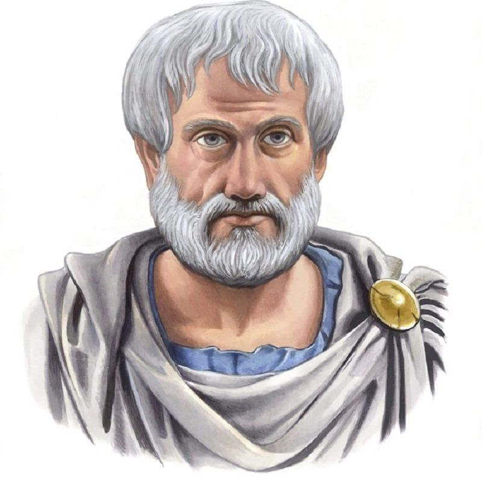

# Word Cloud

## Plato

{width=60%}

The word cloud of Plato shows as below:

<head>

</head>

<body>

  

  
  

  

  
  

  

</body>

We can see some similarities:

* **People** and **man** are mostly mentioned as well as **body** and **soul**.

* **Socrates** appears many times since Plato is the student of him.

## Aristotle

{width=60%}

The word cloud of Aristotle shows as below:
<body>

  

  
  

  

  
  

  

</body>

We can see some similarities:

* **Man** and **animal** appear more frequently.

* What **part**s of **nature** and how they **form**ed is Aristotle's main focus.

## Locke

{width=60%}

The word cloud of John Locke shows as below:
<body>

  

  
  

  

  
  

  

</body>

We can see some similarities:

* **idea** and **reason** take up great percentage of Locke's word.

* **mind** also appears more frequently than others.

## Kant

{width=60%}

The word cloud of Kant shows as below:
<body>

  

  
  

  

  
  

  

</body>

We can see some similarities:

* **reason** is the most frequent word of Kant.

* **experience** also appears in both of the data set.

## Hegel

{width=60%}

The word cloud of Hegel shows as below:

  

  
  

  

  
  

  

We can see some similarities:

* **spirt** appear to be more frequent than others.

## Marx

{width=60%}

The word cloud of Marx shows as below:

<body>

  

  
  

  

  
  

  

</body>

We can see some similarities:

* **production** is more frequent in Marx's word.

* **captial** is important since Marx is the author of *Kapital*.
