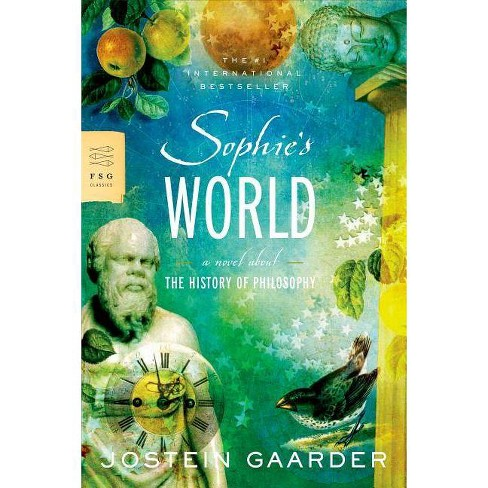

--- 
title: "To be or not to be? Does Sophie's World describe philosopher correctly?"
author: "Haozhong Zheng"
site: bookdown::bookdown_site
---

# Introduction
*Sophie's World* is the novel from Jostein Gaarder. It is one of the most famous novels that introduce the history of philosophy.

{width=60%}

In this project, I choose some of the most famous philosophers listed as follows:

<table>
<tr>
<td>Aristotle</td>
<td>Derrida</td>
<td>Hegel</td>
<td>Heidegger</td>
</tr>
<tr>
<td>Kant</td>
<td>Locke</td>
<td>Marx</td>
<td>Nietzsche</td>
</tr>
<tr>
<td>Plato</td>
<td>Quine</td>
<td>Russel</td>
<td>Smith</td>
</tr>
<tr>
<td>Wittgenstein</td>
<td></td>
<td></td>
<td></td>
</tr>
</table>

In the first two section, I will conduct the sentimental analysis and topic modeling to these philosophers' word to see the cluster plot of them. After that, I choose six chapters from *Sophie's World*, each introduced a philosopher. (**Plato**, **Aristotle**, **Locke**, **Kant**, **Hegel**, **Marx**). I generate the word cloud using philosophy data and text data from *Sophie's World* to see if there are any similarities or differences.
